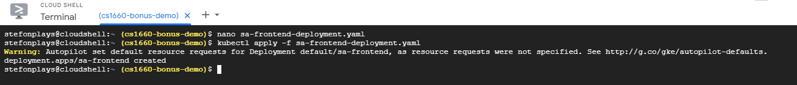

# 14-848 Mini Project

##
This solution was implemented by Stefon Miller, a student who studied the materials earlier. 

## Video walkthrough
[Code walkthrough and demo](https://www.youtube.com/watch?v=zG5EXmwwX14)

## Container URLs
1. [sentiment-analysis-frontend](https://hub.docker.com/repository/docker/smm248/sentiment-analysis-frontend)

2. [sentiment-analysis-webapp](https://hub.docker.com/repository/docker/smm248/sentiment-analysis-webapp)

3. [sentiment-analysis-logic](https://hub.docker.com/repository/docker/smm248/sentiment-analysis-logic)

## Screenshots
1. Screenshot of Kubernetes service IP addresses on GCP:

2. Screenshot of sentiment analysis frontend running on Kubernetes service IP:
 
 
 ## Reproduction steps
 Below are the steps to get my application running on GCP. Before you start, please make sure you have Docker engine, Node, and npm installed and download [this repository](https://github.com/rinormaloku/k8s-mastery) :
 
 1. Navigate to the GCP console and create a new project. For this demonstration, I will name the project "CS1660-Bonus-Demo"
 
 2. Once the project is created, select it in the console
 
 3. After selecting the project, click the hamburger icon in the top left and navigate to Kubernetes Engine->Clusters
 
 4. Enable the Kubernetes Engine API by clicking the "Enable" button. It may take a few minutes for this to finish
 
 5. Once the Kubernetes Engine API has been enabled, click "Create" in the top bar
 
 6. In the configuration settings for the cluster, select "Autopilot"
 
 7. Give the cluster a name and select a region. You don't have to configure any network or advanced settings. For this demo, I will name my cluster "cs1660-bonus-demo". Once finished, click the "Create" button in the bottom. It may take a few minutes to create the cluster. 
 
 8. You should be redirected to a list of all Kubernetes clusters for your current project, including the one you just created. Once the status of your new Kubernetes cluster has a green check next to it, click on the cluster name to select it
 
 9. On the resulting page, click "Connect" in the top bar. Then, click "Run in Cloud Shell" on the popup
 
 10. You should now have a terminal connected to your Kubernetes cluster with a command entered automatically. Press Enter to execute this command, you may have to authorize the GCP API call
 
 11. Create a deployment file for the flask logic pods by executing ``nano sa-logic-deployment.yaml`` and pasting the text from the yaml file in the repository you cloned. The     path to any of the yaml files referenced shoudld be k8s-mastery->resource-manifests. Make sure you replace the "image" tag with "smm248/sentiment-analysis-logic" under spec-     >containers in the yaml file. Save the changes to the file once you are finished.
 
 
 
 12. Once the deployment file has been created, execute ``kubectl apply -f sa-logic-deployment.yaml`` to create the deployment. Verify 2 pods were created by executing ``kubectl   get pods``
 
 
 
 13. Create another yaml file for the logic service by executing ``nano service-sa-logic.yaml`` and pasting in the data from the corresponding file in the Github repository you   cloned. After you save the file, execute ``kubectl apply -f service-sa-logic.yaml``
 
 

 14. Once you have the logic deployment and service running, create a deployment file for the webapp by executing ``nano sa-webapp-deployment.yaml`` and pasting in the data from   the corresponding file in the Github repository you cloned. As with the logic deployment, make sure you replace the "image" tag with "smm248/sentiment-analysis-webapp". Then,   execute ``kubectl apply -f sa-webapp-deployment.yaml``
 
 
 
 15. Create a load balancer service for the web app by creating another yaml file ``nano service-sa-webapp-lb.yaml``. Paste in the data from the corresponding file in the Github   repository and save the yaml file
 
 
 
 16. Create the load balancer service by executing ``kubectl apply -f service-sa-webapp-lb.yaml``
 
 
 
 17. Get the IP of the web app load balancer service by executing ``kubectl get svc``. Make note of the external IP address as well as the port number. Using this IP and port     number, create a URL using the template http://"ip":"port"/sentiment. From the below image, the URL I would use is http://34.73.111.218:80/sentiment

 
 
 18. In the Github repository you cloned, navigate to k8s-mastery/sa-frontend/src/App.js. Edit the IP address on line 23 to match the URL you created from the previous step and   save the file
 
 
 
 19. Navigate to k8s-mastery/sa-frontend in terminal and execute ``npm install`` in order to create a package.json file for the project
 
 
 
 20. Once you have a package.json file, in the same terminal execute ``npm run build`` to create the static files using the IP of our webapp service
 
 
 
 21. Once you have the build created, execute ``docker build -f Dockerfile -t $DOCKER_USER_ID/sentiment-analysis-frontend:kube .`` where $DOCKER_USER_ID is your Docker user ID.   This will create a new image using the webapp service IP
 
 
 
 22. Once the container is built, you can push it to Docker Hub by executing ``docker push $DOCKER_USER_ID/sentiment-analysis-frontend:kube`` using the same user ID as above 
 
 
 
 23. Once you have a frontend container using the IP of the webapp service, you can start creating a load balancing service. Create a yaml with ``nano service-sa-frontend-        lb.yaml``. Paste the code from the repository into this file and save it. Then, execute ``kubectl create -f service-sa-frontend-lb.yaml`` to create the service
 
 
 
 24. Create a new deployment yaml file with ``nano sa-frontend-deployment.yaml``. Paste the data from the Github repository here, but replace the image tag with the tag of the     image you pushed to Docker hub this time. In my case, this will be "smm248/sentiment-analysis-frontend:kube"
 
 
 
 25. Run the deployment using ``kubectl apply -f sa-frontend-deployment.yaml``
 
 
 
 26. Locate the IP of the frontend load balancing service by executing ``kubectl get svc``. In my case, the IP would be 35.196.95.33:80. Navigate to this IP and you should see     the front-end page of the application. 
 
 
 
 
 
 27. The applicaiton should be fully functional at this point. You can enter text into the sentiment analysis box and it should give you a corresponding value
 
 
